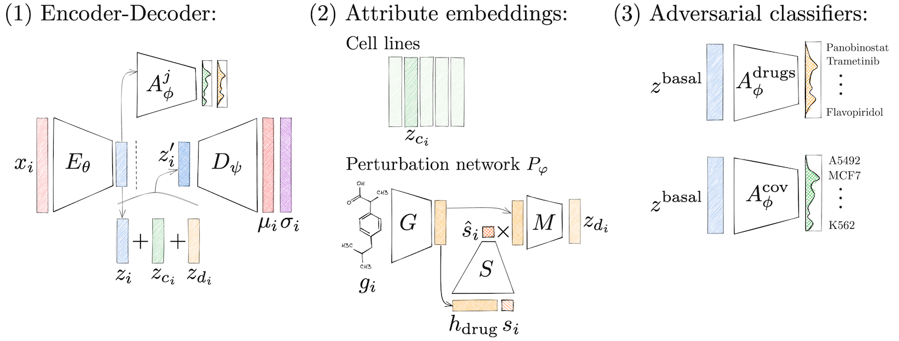

# Predicting Cellular Responses to Novel Drug Perturbations at a Single-Cell Resolution

Code accompanying the [NeurIPS 2022 paper](https://neurips.cc/virtual/2022/poster/53227) ([PDF](https://openreview.net/pdf?id=vRrFVHxFiXJ)).



Our talk on chemCPA at the M2D2 reading club is available [here](https://m2d2.io/talks/m2d2/predicting-single-cell-perturbation-responses-for-unseen-drugs/).
A [previous version](https://arxiv.org/abs/2204.13545) of this work was a spotlight paper at ICLR MLDD 2022.
Code for this previous version can be found under the `v1.0` git tag.

## Codebase overview

- `chemCPA/`: contains the code for the model, the data, and the training loop.
- `embeddings`: There is one folder for each molecular embedding model we benchmarked. Each contains an `environment.yml` with dependencies. We generated the embeddings using the provided notebooks and saved them to disk, to load them during the main training loop.
- `experiments`: Each folder contains a `README.md` with the experiment description, a `.yaml` file with the seml configuration, and a notebook to analyze the results.
- `notebooks`: Example analysis notebooks.
- `preprocessing`: Notebooks for processing the data. For each dataset there is one notebook that loads the raw data.
- `tests`: A few very basic tests.

All experiments where run through [seml](https://github.com/TUM-DAML/seml).
The entry function is `ExperimentWrapper.__init__` in `chemCPA/seml_sweep_icb.py`.
For convenience, we provide a script to run experiments manually for debugging purposes at `chemCPA/manual_seml_sweep.py`.
The script expects a `manual_run.yaml` file containing the experiment configuration.

All notebooks also exist as Python scripts (converted through [jupytext](https://github.com/mwouts/jupytext)) to make them easier to review.

## Getting started

#### Environment
The easiest way to get started is to use a docker image we provide
```
docker run -it -p 8888:8888 --platform=linux/amd64 registry.hf.space/b1ro-chemcpa:latest
```
this image contains the source code and all dependencies to run the experiments.
By default it runs a jupyter server on port 8888.

Alternatively you may clone this repository and setup your own environment by running:

```python
conda env create -f environment.yml
python setup.py install -e .
```


#### Datasets
The datasets are not included in the docker image, but get automatically downloaded when you run the notebooks that require them. Alternatively you may download them manually using the python tool in the `raw_data/dataset.py` folder. Usage is:
```
python raw_data/dataset.py --list
python raw_data/dataset.py --dataset <dataset_name>
```

or you may use the following links:
- [weight checkpoints](https://f003.backblazeb2.com/file/chemCPA-models/chemCPA_models.zip)
- [hyperparameter configuration](https://f003.backblazeb2.com/file/chemCPA-models/finetuning_num_genes.json)
- [raw datasets](https://dl.fbaipublicfiles.com/dlp/cpa_binaries.tar)
- [processed datasets](https://f003.backblazeb2.com/file/chemCPA-datasets/)
- [embeddings](https://drive.google.com/drive/folders/1KzkhYptcW3uT3j4GQpDdAC1DXEuXe49J?usp=share_link)

Some of the notebooks use a *drugbank_all.csv* file, which can be downloaded from [here](https://go.drugbank.com/) (registration needed).

#### Data preparation
To train the models, first the raw data needs to be processed.
This can be done by running the notebooks inside the `preprocessing/` folder in a sequential order.
Alternatively, you may run 

#### Training the models
Run 
```
python chemCPA/train_hydra.py
```

## Citation

You can cite our work as:

```
@inproceedings{hetzel2022predicting,
  title={Predicting Cellular Responses to Novel Drug Perturbations at a Single-Cell Resolution},
  author={Hetzel, Leon and Böhm, Simon and Kilbertus, Niki and Günnemann, Stephan and Lotfollahi, Mohammad and Theis, Fabian J},
  booktitle={NeurIPS 2022},
  year={2022}
}
```
